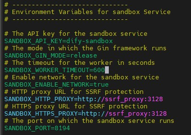

# ITRI-Intent-Based

## 專案簡介
本專案為 ITRI-Intent-Based，整合多個子系統（如 n8n、dify、Dashboard、Backend），用於意圖辨識與流程自動化，支援本地與 Docker 部署。

## 技術棧
- Python（Backend）
- Node.js/React（Dashboard）
- n8n（自動化流程）
- dify（AI/資料處理）
- Docker

## 目錄結構（摘要）
```
ITRI-Intent-Based/
├── Backend/         # 後端服務（Python/Django）
├── Dashboard/       # 前端儀表板（React/Next.js）
├── n8n-version/     # n8n 自動化流程
├── dify-version/    # dify 相關服務
├── build.py         # 部署腳本
├── .env
└── ...
```

## 設置部署環境
### 安裝基本套件
```bash
sudo apt update
sudo apt install git -y
sudo apt install curl -y

wget https://download.docker.com/linux/ubuntu/dists/focal/pool/stable/amd64/containerd.io_1.6.33-1_amd64.deb
wget https://download.docker.com/linux/ubuntu/dists/focal/pool/stable/amd64/docker-ce_24.0.6-1~ubuntu.20.04~focal_amd64.deb
wget https://download.docker.com/linux/ubuntu/dists/focal/pool/stable/amd64/docker-ce-cli_24.0.6-1~ubuntu.20.04~focal_amd64.deb
wget https://download.docker.com/linux/ubuntu/dists/focal/pool/stable/amd64/docker-buildx-plugin_0.14.1-1~ubuntu.20.04~focal_amd64.deb
wget https://download.docker.com/linux/ubuntu/dists/focal/pool/stable/amd64/docker-compose-plugin_2.20.2-1~ubuntu.20.04~focal_amd64.deb

sudo dpkg -i ./containerd.io_1.6.33-1_amd64.deb \
  ./docker-ce_24.0.6-1~ubuntu.20.04~focal_amd64.deb \
  ./docker-ce-cli_24.0.6-1~ubuntu.20.04~focal_amd64.deb \
  ./docker-buildx-plugin_0.14.1-1~ubuntu.20.04~focal_amd64.deb \
  ./docker-compose-plugin_2.20.2-1~ubuntu.20.04~focal_amd64.deb
  
sudo service docker start
sudo usermod -aG docker $USER
newgrp docker
```

### 拉取 ITRI-Intent-Based & 下載套件
```bash
curl -LsSf https://astral.sh/uv/install.sh | sh
source $HOME/.local/bin/env

git clone --recurse-submodules https://github.com/cai-yihua/ITRI-Intent-Based.git
cd ITRI-Intent-Based

uv venv
source .venv/bin/activate

uv pip install -r requirements.txt
```

### 切換專案版本
```bash
git tag
git checkout <tag>
```

### 創建 .env
```bash
nano .env
nano ./Backend/.env
nano ./Dashboard/.env
```

## 執行部署腳本
```bash
uv run python build.py
```


## 問題解決
1. Sandbox 設定問題
    
    
