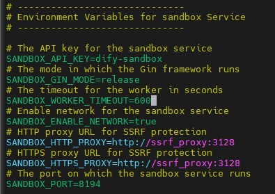

# ITRI-Intent-Base

## 專案簡介
本專案為 ITRI-Intent-Base，整合多個子系統（如 n8n、dify、Dashboard、Backend），用於意圖辨識與流程自動化，支援本地與 Docker 部署。

## 技術棧
- Python（Backend）
- Node.js/React（Dashboard）
- n8n（自動化流程）
- dify（AI/資料處理）
- Docker

## 目錄結構（摘要）
```
ITRI-Intent-Based/
├── Backend/         # 後端服務（Python/Django）
├── Dashboard/       # 前端儀表板（React/Next.js）
├── n8n-version/     # n8n 自動化流程
├── dify-version/    # dify 相關服務
├── build.py         # 部署腳本
├── .env, .env.example
└── ...
```

## 拉取專案
```bash
git clone --recurse-submodules https://github.com/cai-yihua/ITRI-Intent-Based.git
```

## 本地環境部屬
### Backend
1. 安裝 uv
    ```bash
    curl -LsSf https://astral.sh/uv/install.sh | sh
    source $HOME/.local/bin/env
    ```
2. 建立虛擬環境
    ```bash
    cd ..
    uv venv
    ```
3. 啟動虛擬環境
    ```bash
    source .venv/bin/activate
    ```
4. 安裝依賴套件
    ```bash
    uv pip install -r ./Backend/requirements/base.txt
    ```

## docker 環境部屬
### 安裝步驟
部屬順序: n8n, dify, Dashboard, Backend
1. 新增 ```.env```
2. 新增 ```Dashboard/.env```
3. 新增 ```Backend/.env```
4. 修改 ```Backend/Dockerfile```
    ```bash
    FROM python:3.9

    WORKDIR /app

    COPY . .

    RUN pip install --no-cache-dir -r requirements/base.txt

    CMD ["sh", "-c", "python manage.py migrate && python manage.py runserver 0.0.0.0:30000"]
    ```
5. 執行佈署腳本
    ```bash
    uv run python build.py
    ```

### 問題解決
1. Sandbox 設定問題
    
    

## 常見問題
- 啟動錯誤時，請確認 .env 檔案與依賴已正確安裝。
- Docker 部署順序請依照說明：n8n → dify → Dashboard → Backend。
- 若遇到 Sandbox 設定問題，請參考下方圖片。

## 交接注意事項
- 所有敏感資訊（API 金鑰、帳號密碼）請參考各目錄下的 `.env` 或 `.env.example`。
- 若需第三方服務權限，請向前任維護者索取。
- 部署腳本與設定檔請勿隨意更動，若需調整請詳閱註解。

## 維護人員
- 前任維護人員：＿＿＿＿＿＿＿＿＿＿＿＿
- 新任維護人員：＿＿＿＿＿＿＿＿＿＿＿＿
- 聯絡方式：＿＿＿＿＿＿＿＿＿＿＿＿＿＿

> 本文件為交接用範本，請依實際專案內容補充及修正。